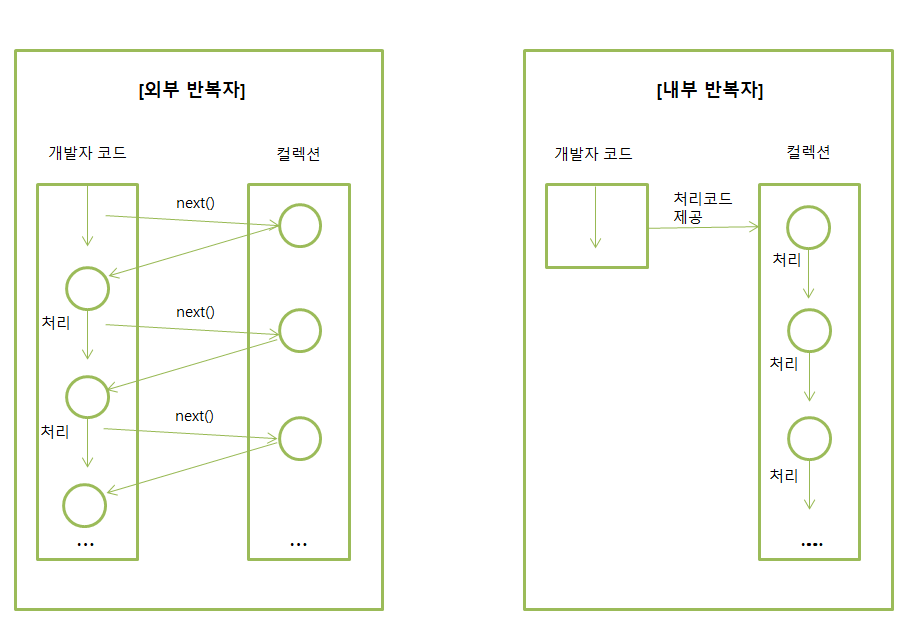

# 스트림(Stream)
> 자바 8부터 추가된 컬렉션의 저장 요소를 하나씩 참조해서 람다식(함수적 스타일)으로 처리할 수 있도록 해주는 반복자이다.

```
List<String> list = Arrays.asList("puregyu", "devyu", "minzzang");

// Java 8 이전
Iterator<String> iterator = list.iterator();
while (iterator.hasNext()) {
    System.out.println(iterator.next());
}

// Java 8 이후 스트림 도입
Stream<String> stream = list.stream();
stream.forEach(name -> System.out.println(name));

```

#### 스트림의 특징
Stream과 Iterator는 비슷한 역할을 하는 반복자이지만, 람다식으로 요소 처리 코드를 제공하는 점과
내부 반복자를 사용하므로 병렬 처리가 쉽다는 점 그리고 중간 처리와 최종 처리 작업을 수행하는 점에서 많은 차이를
가지고 있다.



- 외부반복자
   -    개발자가 코드로 직접 컬렉션 요소를 반복해서 가져오는 코드 패턴
   -    index를 이용하는 for문, Iterator를 이용하는 while문
- 내부반복자
   -    컬렉션 내부에서 요소들을 반복시키고, 개발자는 요소당 처리해야 할 코드만 제공하는 코드 패턴
   -    컬렉션 내부에서 어떻게 요소를 반복시킬 것인가는 컬렉션에게 맡겨두고, 개발자는 요소 처리 코드에만 집중할 수 있다는 장점이 있음
   -    내부반복자는 요소들의 반복 순서를 변경하거나, 멀티코어 CPU를 최대한 활용하기 위해 요소들을 분배시켜 병렬 작업을 할 수 있게 도와주기 때문에 하나씩 처리하는 순차적 외부 반복자보다 효율적으로 요소를 반복
 
 ```
List<String> list = Arrays.asList("A", "B", "C", "D", "E");

// 순차 처리
Stream<String> stream = list.stream();
stream.forEach(s -> System.out.println("순차 처리 쓰레드 : " + Thread.currentThread().getName()));

// 병렬 처리
Stream<String> stream2 = list.parallelStream();
stream2.forEach(s -> System.out.println("병렬 처리 쓰레드 : " + Thread.currentThread().getName()));

// 결과
순차 처리 쓰레드 : main
순차 처리 쓰레드 : main
순차 처리 쓰레드 : main
순차 처리 쓰레드 : main
순차 처리 쓰레드 : main

병렬 처리 쓰레드 : main
병렬 처리 쓰레드 : ForkJoinPool.commonPool-worker-2
병렬 처리 쓰레드 : main
병렬 처리 쓰레드 : ForkJoinPool.commonPool-worker-9
병렬 처리 쓰레드 : main
```

#### 스트림의 종류
java.util.stream 패키지에는 `BaseStream` 인터페이스를 부모로 하여 `Stream`, `IntStream`,
 `LongStream`, `DoubleStream` 인터페이스가 상속 구조로 되어있다.

#### 스트림의 중간 처리와 최종 처리
스트림은 데이터의 필터링, 매핑, 정렬, 그룹핑 등의 중간 처리와 합계, 평균, 카운팅, 최대값, 최소값 등의 최종 처리를 
파이프라인(pipelines)으로 해결한다. 파이프라인에서 최종 처리를 제외하고 모두 중간 처리 스트림이다.

중간 처리 스트림은 바로 진행되는 것이 아니라 최종 처리가 시작 되기 전까지 지연(lazy)된다. 최종 처리가 시작되면 비로소 컬렉션의 요소가 하나씩 
하나씩 중간 스트림에서 처리되고 최종 처리를 진행한다.

```
public class PipeStreamTest {
    public static void main(String[] args) {
        List<Member> list = Arrays.asList(
                new Member("min", 20, "Math"),
                new Member("gyu", 30, "English"),
                new Member("zzn", 40, "MAth")
                );

        double ageAvg = list.stream().filter( m-> m.major == "Math").mapToInt(Member::getAge).average().getAsDouble();
        System.out.println(ageAvg); // 결과 : 20.0
    }

    static class Member {
        private String name;
        private int age;
        private String major;

        public Member(String n, int a, String m) {
            this.name = n;
            this.age = a;
            this.major = m;
        }

        public String getMajor() {
            return major;
        }

        public void setMajor(String major) {
            this.major = major;
        }

        public String getName() {
            return name;
        }

        public void setName(String name) {
            this.name = name;
        }

        public int getAge() {
            return age;
        }

        public void setAge(int age) {
            this.age = age;
        }
    }
}
```

#### 중간처리 메소드와 최종처리 메소드
- filter()
    -   요소를 걸러내는 역할
- distnct()
    -   중복을 제거하는 역할
    -   Stream의 경우 `Object.equals(Object)` 가 true이면 동일한 객체로 판단하고 중복 제거
    -   ```
        names.stream().distinct().forEach(n->System.out.println(m)); // 이름 중복 제거
        ```
- flatMapXXX()
    -   요소를 대체하는 복수 개의 요소들로 구성된 새로운 스트림을 리턴
- sorted()
    -   요소가 최종 처리되기 전에 중간 단계에서 요소를 정렬해서 최종 처리 순서를 변경
    
