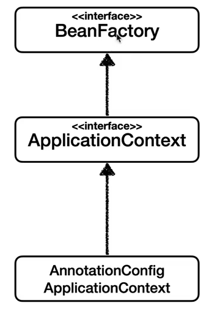
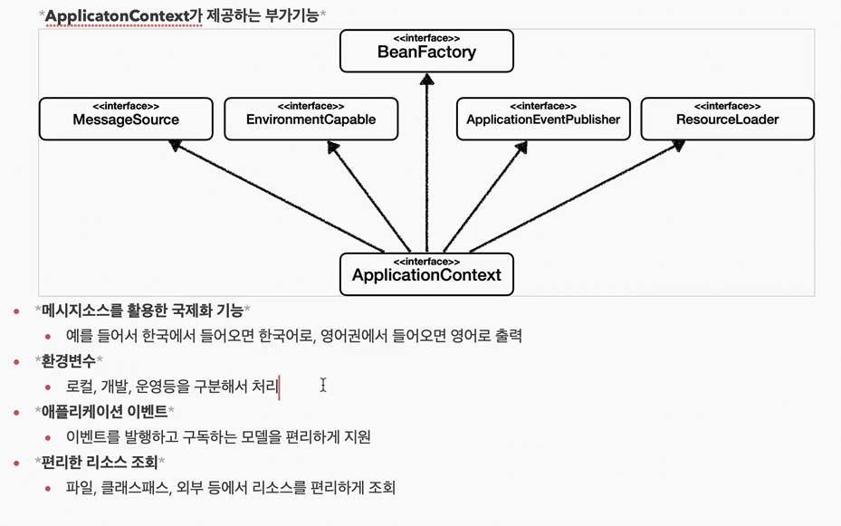

### BeanFactory와 ApplicationContext

-----

##### BeanFactory
> 스프링 컨테이너의 최상위 인터페이스이며, 스프링 빈을 관리하고 조회하는 역할
 
##### ApplicationContext

> `BeanFactory`의 기능을 상속받아 사용하며, 국제화 / 환경변수 / 이벤트 / 리소스 등 추가적인 부가기능이 포함되어 있다.

BeanFactory, ApplicationContext 모두 일반적으로 스프링 컨테이너라고 부른다.