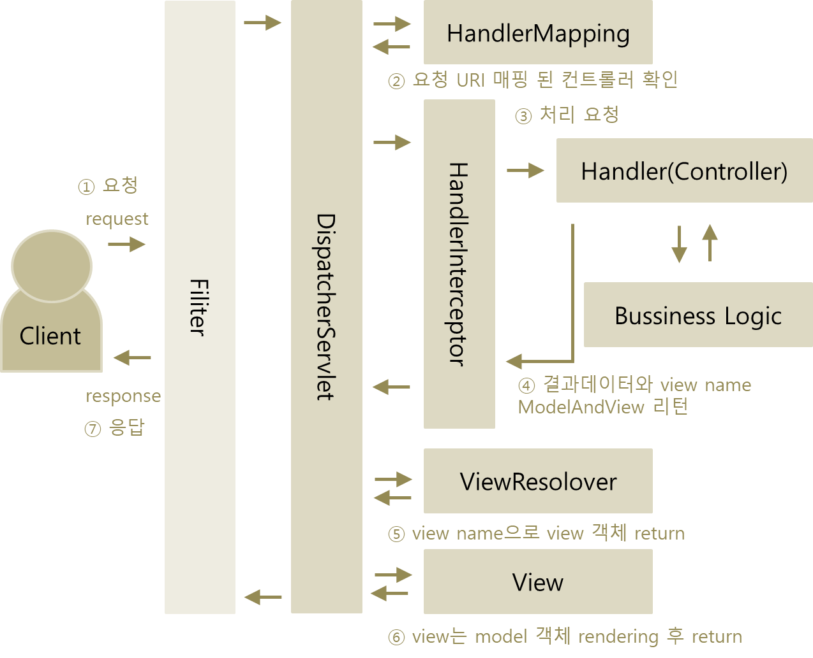

# Filter
> ServletContext의 기능으로 사용자에 의해 서블릿이 호출되기 전과 후로 사용자의 요청과 응답을 filtering 할 수 있도록
> 도와주는 작업을 의미한다.



 - 필터는 DispatcherServlet 앞의 최상단에서 먼저 동작한다.
 - 일반적으로 encoding, CORS, XSS, LOG, 인증, 권한 등을 처리한다.
 - Interceptor 보다 우선적으로 요청을 처리한다.
 
#### FilterRegistrationBean
 - 객체생성 방법 : 스프링부트 org.springframework.boot.web.servlet
 - ```
   @Configuration
   public class FilterConfig
   {
   	@Bean
   	public FilterRegistrationBean getFilterRegistrationBean()
   	{
   		FilterRegistrationBean registrationBean = new FilterRegistrationBean(new MyFilter());
   		// registrationBean.addUrlPatterns("/*"); 
   		return registrationBean;
   	}
   }
   ```
   
#### @WebFilter
 - 어노테이션 방법
 - ```
   @SpringBootApplication
   @ServletComponentScan // 추가 
   public class ApiApplication {
   
       public static void main(String[] args) {
           SpringApplication.run(ApiApplication.class, args);
       }
   
   }
   ```
 - ```
   @WebFilter(urlPatterns = "/**")
   public class MyFilter implements Filter {
        ...  
        implements method...
        ...
   }
   ```