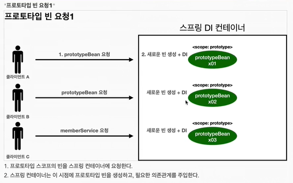
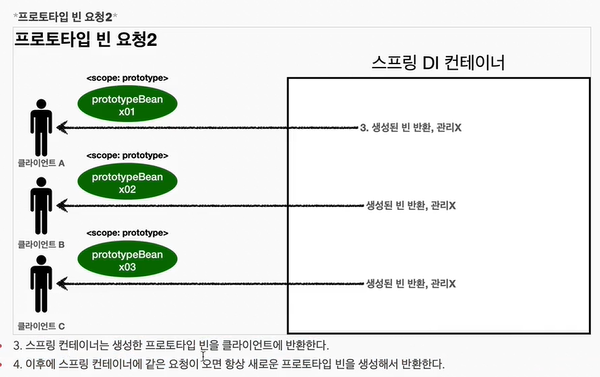
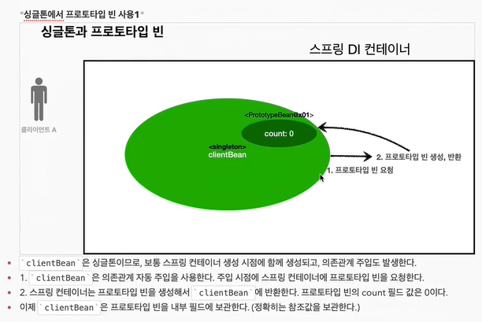
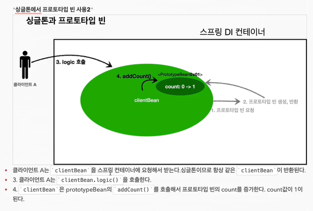
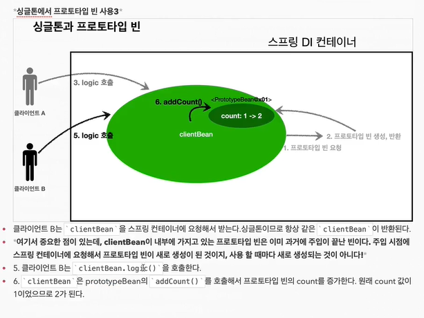

## 빈 스코프

---

스프링이 지원하는 빈 스코프는 아래와 같다.
1. 싱글톤 - 스프링 컨테이너 시작부터 종료까지 유지되는 가장 넓은 범위의 스코프
2. 프로토타입 - 빈의 생성과 의존과계 주입까지 관여. 그 이후는 관리하지 않는 짧은 범위의 스코프(빈 자체도 Lazy하게 생성)
   
   
   
   `프로토 타입`의 핵심은 스프링 컨테이너가 빈을 생성하고 의존관계 주입, 초기화까지만 관여한다는 점이다. 그래서 `@PreDestroy` 같은 빈 소멸 시 수행되는 메서드가 동작하지 않는다.
   ```java
   public class PrototypeTest {

    @Test
    void prototypeBeanFind() {

        AnnotationConfigApplicationContext ac = new AnnotationConfigApplicationContext(PrototypeBean.class);

        System.out.println("find prototype bean - 1");
        PrototypeBean bean1 = ac.getBean(PrototypeBean.class); // 스프링 빈에 의한 객체 생성 시점(Lazy)

        System.out.println("find prototype bean - 2");
        PrototypeBean bean2 = ac.getBean(PrototypeBean.class); // 스프링 빈에 의한 객체 생성 시점(Lazy)

        System.out.println("bean1 = " + bean1);
        System.out.println("bean2 = " + bean2);

        // 스프링 컨테이너 종료
        ac.close();

        Assertions.assertThat(bean1).isNotSameAs(bean2);

    }

    @Scope(ConfigurableBeanFactory.SCOPE_PROTOTYPE)
    static class PrototypeBean {

        @PostConstruct
        public void init() {
            System.out.println("PrototypeBean.init");
        }

        @PreDestroy
        public void close() {
            System.out.println("PrototypeBean.close");
        }

    }

   }
   // 출력 결과
   // find prototype bean - 1
   // PrototypeBean.init
   // find prototype bean - 2
   // PrototypeBean.init
   // bean1 = com.example.test.scope.PrototypeTest$PrototypeBean@33f676f6
   // bean2 = com.example.test.scope.PrototypeTest$PrototypeBean@4c5ae43b
   ```
   일반적으로 두 객체의 인스턴스가 다른 것을 알 수 있다.   
   또한, 해당 테스트 케이스를 보면 `getBean()` 메서드를 통해 스프링 컨테이너에서 스프링 빈을 가져오려는 시점에서 객체를 생성하는 것을 볼 수 있다. (Lazy하게 객체를 생성하는 방식을 확인)   
   그리고 `close()` 메서드를 통해여 스프링 컨테이너를 종료시켰음에도 소멸에 대한 콜백, 즉 `@PreDestroy` 애노테이션이 적용된 
   메서드가 작동하지 않은 것을 확인할 수 있는데, 이는 `프로토타입`의 경우 스프링 컨테이너가 소멸주기까지 관리하지 않음을 의미한다.

   > 싱글톤과 프로토타입 함께 사용시 문제점 발생?

   싱글톤 빈이 의존관계 주입을 통해서 프로토타입 빈을 주입받는 경우,
   
   
   
   ```java
   public class SingletonWithPrototypeTest {

    @Test
    void singletonClientUsePrototype() {
        AnnotationConfigApplicationContext ac = new AnnotationConfigApplicationContext(ClientBean.class, PrototypeBean.class);

        ClientBean bean1 = ac.getBean(ClientBean.class);
        int count1 = bean1.logic();
        Assertions.assertThat(count1).isEqualTo(1);

        ClientBean bean2 = ac.getBean(ClientBean.class);
        int count2 = bean2.logic();
        Assertions.assertThat(count2).isEqualTo(2);

    }

    @Scope(ConfigurableBeanFactory.SCOPE_SINGLETON)
    static class ClientBean {
        private final PrototypeBean prototypeBean; // 생성시점에 최초로 주입된 PrototypeBean을 계속 쓰게 된다.

        @Autowired // 싱글톤인 ClientBean을 생성하는 시점에서 의존관계 주입이 필요하므로 스프링 빈에게 요청한다. 
        ClientBean(PrototypeBean prototypeBean) {
            this.prototypeBean = prototypeBean;
        }

        public int logic() {
            prototypeBean.addCount();
            return prototypeBean.getCount();
        }

    }

    @Scope(ConfigurableBeanFactory.SCOPE_PROTOTYPE)
    static class PrototypeBean {

        private int count = 0;

        public void addCount() {
            count++;
        }

        public int getCount() {
            return count;
        }

        @PostConstruct
        public void init() {
            System.out.println("PrototypeBean.init " + this);
        }

     }

   }
   ```
   위의 소스를 보면 `싱글톤 스코프` 객체가 `프로토타입 스코프` 객체를 의존관계로 주입 받을 경우, 싱글톤 스코프로써의 동작한다는 것을 확인할 수 있다.

   해결 방법은 무엇일까?
   ```java
   @Scope(ConfigurableBeanFactory.SCOPE_SINGLETON)
    static class ClientBean {

        private ObjectProvider<PrototypeBean> prototypeBeanProvider;

        @Autowired
        public ClientBean(ObjectProvider<PrototypeBean> prototypeBeanProvider) {
            this.prototypeBeanProvider = prototypeBeanProvider;
        }

        public int logic() {
            PrototypeBean prototypeBean = prototypeBeanProvider.getObject();
            prototypeBean.addCount();
            return prototypeBean.getCount();
        }

    }
   ```
   -> `ObjectProvider` 사용
  
   `ObjectProvider`의 핵심은 싱글톤 객체에서 프로토타입 객체를 의존관계 주입을 받기 위해 사용하는 것이 아니라, 
   스프링 컨테이너를 통해서 빈을 찾아내는 `dependency lookup(DL)` 을 간단하게 수행해주는 기능을 제공할 뿐이다. 
3. 웹 스코프
   1. request - 웹 요청이 들어오고 나갈때 까지 유지
   2. session - 웹 세션이 생성되고 종료될 때 까지 유지
   3. application - 웹의 서블릿 컨텍스트와 같은 범위로 유지