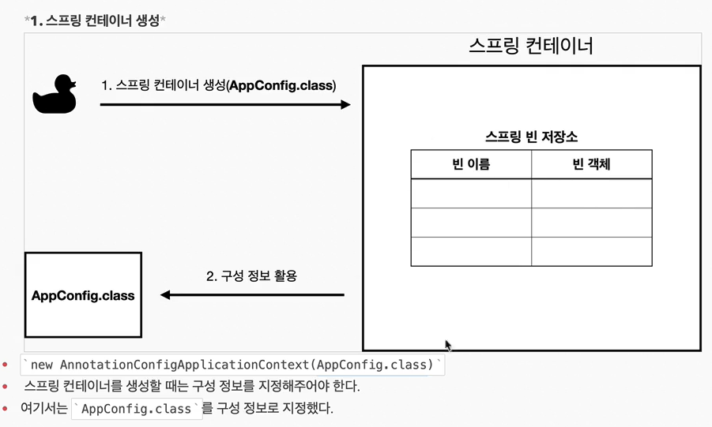
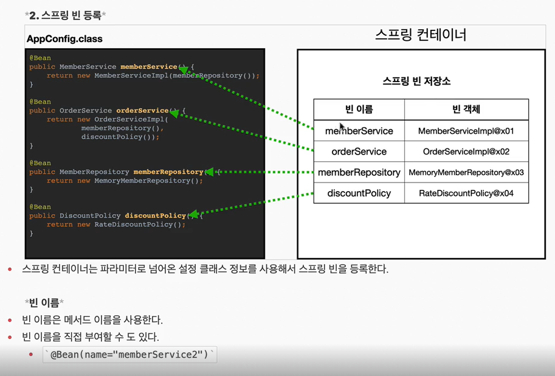
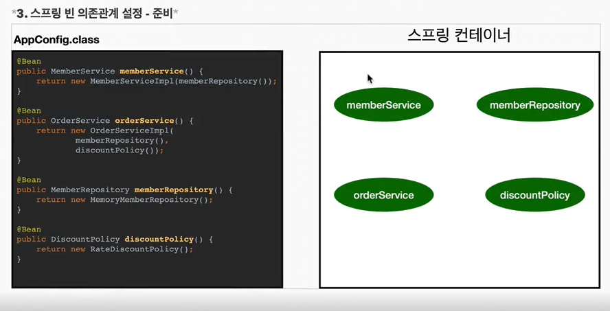
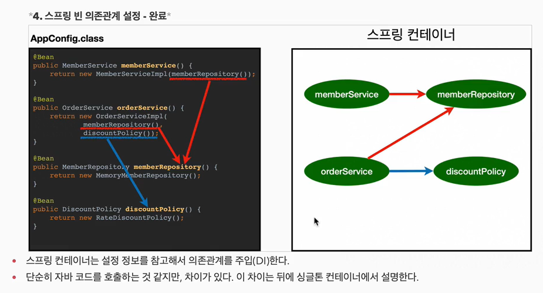

### 스프링 컨테이너

----

#### 스프링 컨터에너란?

`ApplicationContext` 를 스프링 컨테이너라 한다.
스프링 컨테이너는 `@Configuration`이 붙은 `AppConfig`를 설정정보 클래스로 사용한다.    
설정정보 클래스에 `@Bean`이 붙어있는 메서드를 런타임 시, 모두 호출해서 반환된 객체를 스프링 컨테이너에 등록한다. 이렇게 등록된 객체는 `스프링 빈`이라고 부른다.   

```java
@Configuration
class AppConfig {

    @Bean // Bean에 등록될 때 이름은 메서드 명을 우선으로 한다. `memberRepository`
    public MemberRepository memberRepository() {
        return new JdbcMemberRepository();
    }

}
```

```java
// 스프링 컨데이너
ApplicationContext ac = new AnnotationConfigApplicationContext(AppConfig.class);
// 빈 꺼내오기
MemberRepository memberRepository = ac.getBean("memberRepository", MemberRepository.class);
```

기존에는 개발자가 직접 자바코드로 AppConfig 생성부터 모든 것을 했지만 스프링을 사용하게 되면 스프링 컨테이너에 객체들을 스프링 빈으로 등록시켜두고 컨테이너에서 원하는 스프링 빈을 찾아서 사용할 수 있게 된 것이다.

#### 스프링 컨테이너 생성과정






스프링은 `빈(Bean)을 생성`하고 `의존관계를 주입`하는 단계가 나누어져 있다.   
생성자 주입방식을 통하면 빈 생성과 의존관계 주입이 한번에 처리된다.

#### 스프링 빈 조회 - 상속관계
부모 타입으로 스프링 빈을 조회하면 자식 타입도 함께 조회된다.
