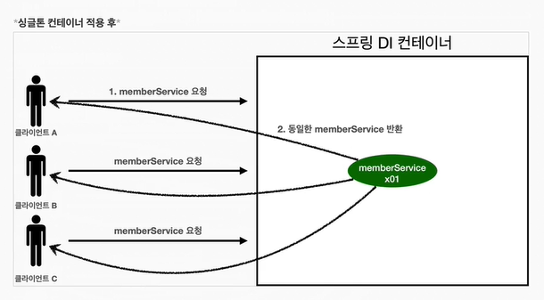
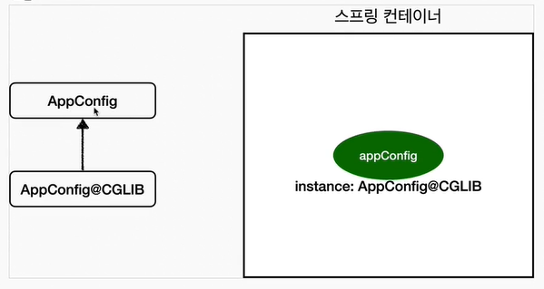
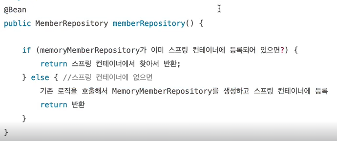

### 스프링과 싱글톤

-----

클래스의 인스턴스가 1개만 생성되는 디자인 패턴을 `싱글톤 패턴`이라고 부른다.   

```java
// 코드레벨
public class SingletonService {

    // static을 사용하여 class 레벨에서 관리한다.
    private static final SingletonService instance = new SingletonService();

    public static SingletonService getInstance() {
        return instance;
    }
    
    // new keyword 제한
    private SingletonService() {}
    
}
```


스프링은 웹 애플리케이션을 기반으로 발전한 프레임워크이며, 다수의 클라이언트로부터 들어오는 트래픽을 리소스의 낭비없이 처리할 수 있도록 기본적으로 **싱글톤**으로 설계되어 있다.
   
**스프링 컨테이너**는 스프링 빈을 모두 싱글톤으로 관리하고 있으며, 위의 코드를 통하여 개발자가 객체를 싱글톤으로 만들어주지 않아도 자동으로 생성 및 관리해준다. (== `싱글톤 레지스트리`)

#### 싱글톤 패턴의 주의점
> 여러 클라이언트가 하나의 인스턴스를 공유하기 때문에 싱글톤 객체는 `무상태(stateless)`로 설계해야 한다. <br>
    - 특정 클라이언트에 의존하는 필드는 존재할 수 없다. <br>
    - 특정 클라이언트가 값을 변경할 수 있는 필드는 존재할 수 없다. <br>
    - 가급적 읽기만 지원해야 한다. <br>
    - 필드 대신에 자바에서 공유되지 않는 지역변수, 파라미터, ThreadLocal을 사용해야 한다. <br>

```java
// 싱글톤 인스턴스일 경우, 동시성에 큰 이슈가 발생하는 코드
public class StatefulService {
    
    // 상태가 유지 된다.
    private int price;

    public void order(String name, int price) {
        System.out.println("price = " + price);
        this.price = price;
    }

    public int getPrice() {
        return price;
    }
    
}
```

#### @Configuration 역할
```java
@Configuration
public class AppConfig {

    @Bean
    public MemberSerivce memberSerivce() {
        return new MemberSerivceImpl(memberRepository());
    }

    @Bean
    public OrderService orderService() {
        return new OrderServiceImpl(memberRepository());
    }

    @Bean
    public MemberRepository memberRepository() {
        return new JdbcMemberRepository();
    }
    
}
```
위 코드에서 Bean을 생성하는 사이클을 보면   
1. `memberSerivce()` 호출 -> `memberRepository()` 호출 -> `new JdbcMemberRepository()` 생성 반환 -> `new MemberSerivceImpl(...)` 생성 반환
2. `orderService()` 호출 -> `memberRepository()` 호출 -> `new JdbcMemberRepository()` 생성 반환 -> `OrderServiceImpl(...)` 생성 반환 

순수하게 Java Code로 이해하면 `new JdbcMemberRepository()` 가 new 키워드로 인하여 2개의 인스턴스가 생성되는 것으로 보인다. 과연 이것이 **싱글톤**이 맞을까?   

정답부터 말하면 싱글톤이 맞으며 1개의 인스턴스가 생성되는 것이 맞다.   
스프링 컨테이너는 `싱글톤 레지스트리`라서 스프링 빈이 싱글톤이 되도록 보장해주어야 한다. 
`@Configuration`을 통하여 이를 해결하였다.

```java
@Test
void test() {
    AnnotationConfigApplicationContext ac = new AnnotationConfigApplicationContext(AppConfig.class);
    AppConfig bean = ac.getBean(AppConfig.class);
    System.out.println(bean.getClass());
    // 출력결과 : class com.example.test.spring.AppConfig$$SpringCGLIB$$0
}
```

일반적으로 순수한 클래스라면 `class com.example.test.spring.AppConfig` 처럼 출력되어야 하지만 
`$$SpringCGLIB$$0` 가 뒤에 붙어있는 것을 확인할 수 있다.   
그렇다면 개발자가 만든 class가 아니라 스프링이 빈을 등록하는 과정에서 또다른 조작이 있음을 의미한다. 
즉, 스프링은 CGLIB라는 바이트코드 조작 라이브러리를 사용해서 AppConfig 클래스를 상속받은
임의의 다른 클래스를 만들고, 그 클래스를 스프링 빈으로 등록한 것이다. 
그것을 가능하게 해주는 것이 `@Configuration` 의 역할이다.



이렇듯 바이트코드를 조작하여 스프링 빈에 등록된 CGLIB 클래스(마치 내가 만들것 같은)가 싱글톤을 보장해주는 것이다.

위 와 같은 코드가 포함되어 있을것으로 예상된다.

@Bean이 붙은 메서드마다 스프링 빈에 등록이 되어있는지 확인을 하고, 
등록되어 있다면 skip 처리 / 등록되어 있지 않다면 기존 로직을 진행하여 등록처리 하며 싱글톤을 보장하는 것이다.