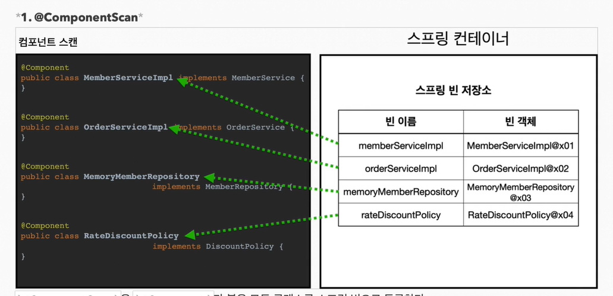
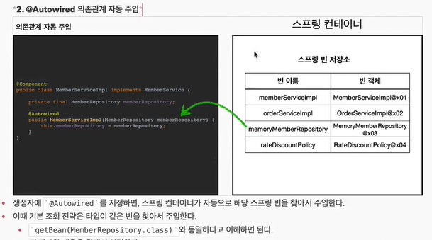

## @Component와 @ComponentScan 그리고 @Autowired

---

스프링 빈을 등록할 때, 설정정보 class에서 `@Bean` 이나 또는 XML의 `<bean> ~ </bean>`을 사용하여 등록하곤 한다.

하지만 등록할 스프링 빈의 개수가 많아지면 이것을 하나하나 등록해주는 것도 쉽지않다. 
이런 귀찮음을 해소방법으로 스프링에서는 설정 정보가 없어도 자동으로 스프링 빈을 찾아서 등록하는 `@Component`와 `@ComponentScan`이라는 기능을 제공 한다.

```java
@configuration
@ComponentScan // @Component 가 있는 class를 찾아 빈으로 등록한다.
public class AutoAppConfig {

}

@Component // @ComponentScan 의 스캔 대상이 되는 class, 즉 스프링 빈으로 등록이 된다.
public class JdbcMemberRepository implements MemberRepository {
    ...
}

```

컴포넌트 스캔을 이용하지 않고 빈을 등록하던 방법을 다시 생각해보자.
```java
// 컴포넌트 스캔을 이용하지 않는 설정정보 소스
@configuration
public class AppConfig {

    @Bean
    public MemberService memberService() {
        return new MemberServiceImpl(memberRepository());
    }

    @Bean
    private MemberRepository memberRepository() {
        return new MemoryMemberRepository();
    }
    
}

public class MemberServiceImpl implements MemberService {
    
    private final MemberRepository memberRepository;

    public MemberServiceImpl(MemberRepository memberRepository) {
        this.memberRepository = memberRepository;
    }
    
    ...
}
```
`@Bean` 을 통해 직접 스프링 빈을 등록하고, 의존관계도 직접 Config class 내부에서 명시한다.
( == `new MemberServiceImpl(memberRepository())`)   

이어서 `@ComponentScan`, `@Component`, 그리고 `@Autowired` 를 통해 스프링 빈을 생성하고 의존관계 주입하는 방법을 알아보자.
```java
@configuration
@ComponentScan // @Component 가 있는 class를 찾아 빈으로 등록한다.
public class AutoAppConfig {

}

@Component // @ComponentScan 에 의하여 해당 class 는 스프링 빈으로 등록된다 
public class MemberServiceImpl implements MemberService {
    
    private final MemberRepository memberRepository;
    
    @Autowired // @Autowired 를 사용하여 스프링 빈 목록을 뒤져 동일한 타입의 객체를 가져와서 의존관계 자동주입
    public MemberServiceImpl(MemberRepository memberRepository) {
        this.memberRepository = memberRepository;
    }
}

@Component // @ComponentScan 에 의하여 해당 class 는 스피링 빈으로 등록된다
public class MemoryMemberRepository implements MemberRepository {

    private static final Map<Long, Member> m = new HashMap<>();
    @Override
    public void save(Member member) {
        m.put(member.getId(), member);
    }

    @Override
    public Member findById(Long memberId) {
        return m.get(memberId);
    }

}
```
`@ComponentScan`은 `@Component` 가 붙어있는 class를 찾아 스프링 빈으로 등록하고 의존관계 주입이 필요한 클래스의 경우, `@Autowired` 애노테이션을 통해 의존관계 자동주입을 한다.
이때, 스프링 빈 목록에 자동주입될 객체가 등록이 되어 있어야 한다.

   
스프링 빈의 기본 이름은 클래스명을 사용하되 맨 앞글자만 소문자로 변경하여 등록된다.   

   
생성자에 `@Autowired`를 지정하면, 스프링 컨테이너가 자동으로 스프링 빈 목록에서 같은 타입의 빈을 찾아서 주입해 준다.

#### 빈 중복 등록과 충돌
>   자동 빈 등록 vs 자동 빈 등록 = 컴파일 에러 발생 <br>
    수동 빈 등록 vs 자동 빈 등록 = Override 되어 수동 빈이 우선권을 가짐(최근 스프링부트에서는 에러가 발생하도록 바뀌었음)